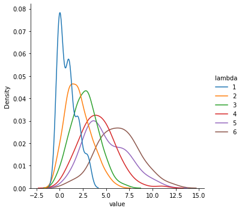
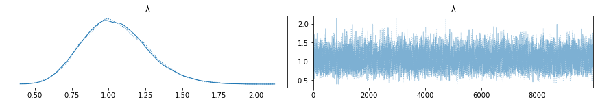

# Frequentist & Bayesian Statistics With Py4J & PyMC3
----------

In this post I want to go back to the basics of statistics, but with an advanced spin on things. By "advanced spin" I mean, both from in terms of mathematics and computational techniques. The topic will dive into is:

- Estimating a single parameter value from a distribution and then quantifying the uncertantity in the estimate.
    
In general I will take two approaches to quantitfying the uncertainity in the estimate, the first of which is [frequentist](https://en.wikipedia.org/wiki/Frequentist_inference) and second that is [Bayesian](https://en.wikipedia.org/wiki/Bayesian_statistics). I was originally inspired by [Jake VanderPlas' post](http://jakevdp.github.io/blog/2014/03/11/frequentism-and-bayesianism-a-practical-intro/) and admit, I am not very seasoned using Bayesian methods. That's why I'll be sticking to a simple example of estimating the mean rate or 𝜆 in a [Poisson distribution](https://en.wikipedia.org/wiki/Poisson_distribution#) from sampled data.  An image of the Poisson distribution for various 𝜆 values which we wish to esimate are shown below:

From the computational perspective, I wanted to do something different and decided to write the probability distribution for generating the data in [Scala](https://www.scala-lang.org/), but then use it with Python. Why did I do this? Well, I like Scala and enjoyed the challenge of writing a Poisson distribution using a functional approach. I also wanted to learn more about [Py4J](https://www.py4j.org/) which can be used to work with functions and objects in the [JVM](https://en.wikipedia.org/wiki/Java_virtual_machine) from Python. [Apache Spark](https://spark.apache.org/) actually uses Py4J in PySpark to write Python wrappers for their Scala API. I've used both PySpark and Spark in Scala extensively in the past and doing this project gave me an opportunity to understand how PySpark works much better.

In this post I covered [maximum likelyhood estimators (MLE)](https://en.wikipedia.org/wiki/Maximum_likelihood_estimation) and [Bayesian](https://en.wikipedia.org/wiki/Bayesian_inference) point estimators. The MLE in this case was simple and I could show how to quanitify the uncertaintity in the estimate using confidence intervals from the [Fisher information](https://en.wikipedia.org/wiki/Fisher_information). I use [PyMC3](https://docs.pymc.io/) to calculate two Bayesian estimators and the [credible Interval](https://en.wikipedia.org/wiki/Credible_interval). PyMC's makes it easy [MCMC](https://en.wikipedia.org/wiki/Markov_chain_Monte_Carlo) methods to calculate and visualize posterior distributions for the parameter of interest as shown below,

One can also show that in the limit of large data Bayesian estimators and Maximum Likelyhood estimators converge to the same thing! This is called the [Bernstein-von Miss Theorem](
https://en.wikipedia.org/wiki/Bernstein%E2%80%93von_Mises_theorem).

## Building The Jar
--------
You first need to compile the [Scala](https://www.scala-lang.org/) code and build the [uber jar](https://stackoverflow.com/questions/11947037/what-is-an-uber-jar) using [Maven](https://maven.apache.org/)

	mvn package
    
## Starting Java Server & Jupyter Lab With The Docker
--------------------
You build the docker images,

    docker compose build

The start up the containers through,

    docker compose up

You can shut down the contains using 

    docker compose down

## Libraries:
----------
0. [Docker 20.10.5](https://www.docker.com/)
1. [Apache Maven 3.6.0](https://maven.apache.org/)
2. [Scala 2.12.6](https://www.scala-lang.org/)
3. [Py4J 0.10.9.2](https://www.py4j.org/)
4. [Python 3.7](https://www.python.org/)
5. [PyMC3 3.11.2](https://docs.pymc.io/)
6. [Seaborn 0.11.0](https://seaborn.pydata.org/)
7. [ArivZ 0.11.2](https://arviz-devs.github.io/arviz/)

